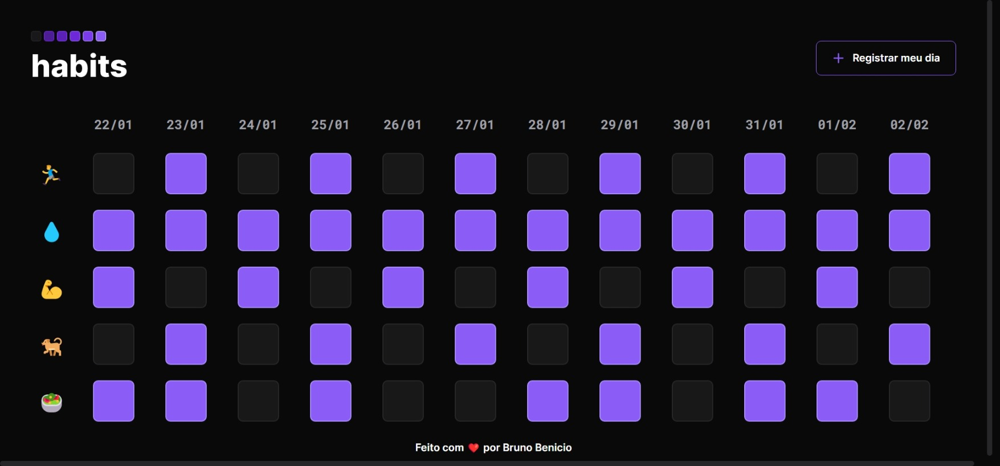

<h1 align="center"> NLW Setup 22-01-2023 </h1>

Evento exclusivo e gratuito, promovido pela Rocketseat para ensino de tecnologias WEB.

  <a href="#-tecnologias">Tecnologias</a>&nbsp;&nbsp;&nbsp;|&nbsp;&nbsp;&nbsp;
  <a href="#-projeto">Projeto</a>&nbsp;&nbsp;&nbsp;|&nbsp;&nbsp;&nbsp;
  <a href="#-layout">Layout</a>&nbsp;&nbsp;&nbsp;|&nbsp;&nbsp;&nbsp;
  <a href="#memo-licença">Licença</a>

  

 

  

## 🔗 Deploy
<a href="https://nlw-setup-carecsnay.vercel.app/">Vercel 🟢</a> 

<a href="https://carecsnay.github.io/NLW-SETUP/">GitPages 🟢</a>

## 🚀 Tecnologias

Esse projeto foi desenvolvido com as seguintes tecnologias:

- HTML e CSS
- JavaScript e JSON
- LocalStorage

- Library Externa - <a href="https://maykbrito.github.io/libs/NLWSetup/documentation/NLWSetup.html">NLW Setup (doc)</a>

## 💻 Projeto

O Habits é um app para ajudar a rastrear os hábitos e otimizar a sua rotina diária.
## 🪪 Licença

Esse projeto está sob a licença MIT.

---

Feito com ❤️ por Bruno Benicio em parceria com a Rocketseat 💜
